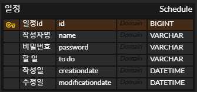
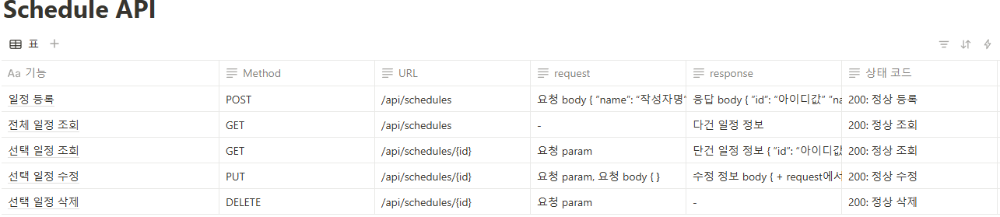

# schedule

아래 표는 사진에 다 담지 못한 내용들만 따로 정리해서 표로 만든 것 입니다.

등록 request | 등록 response                                                                                                                                                      |선택 조회 response |수정 response                                                                                            |
|---------------------|------------------------------------------------------------------------------------------------------------------------------------------------------------------|--------------------------------------------------------------------------------------------------------|---|
| 요청body  {  ”name”:“작성자명”,  ”password”: “비밀번호”, ”to do”: “할 일”  } | 응답body   {  ”id”: “아이디값”,  ”name”:  “작성자명”,  ”to do”:  “할 일”,  ”creationdate”: “작성일”,   ”modificationdate”:”수정일”  } |단건 일정 정보 { ”id”: “아이디값”, ”name”:  “작성자명”, ”to do”:  “할 일”, ”creationdate”:  “작성일” ”modificationdate”: ”수정일” } |수정 정보 body { \+ request에서 수정 요청한 것들, ”creationdate”:  “작성일”, ”modificationdate”: “수정일” } 

