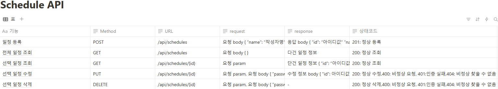

# Spring-Project-Schedule

Spring 사용하여 level0, 1, 2 challenge leve3,4,5,6  단계별로 일정 관리 앱 만들기
 
 
각 브랜치 read.me도 있으니 확인해주세요.
 
level0은 main브랜치에 했습니다.
-------

## 프로젝트 개요

프로젝트명 : 일정 관리 앱  

프로젝트 목적 :

- Spring의 기초 학습
- 웹 개발에 필수적인 CRUD (Create, Read, Update, Delete) 기능을 구현
- JDBC를 실습하여 데이터베이스와의 직접적인 연동을 이해하기

사용언어 : Java

-----

## 레벨별 요구 사항

-----
### 필수기능 Lv1, Lv2 구현⭕ 

---
### 도전기능 LV3 , LV4, LV5, LV6   구현❌  

------

## Lv 0. API 명세 및 ERD 작성
- API 명세서 작성
- ERD 작성
- SQL 작성
### ERD

### API

아래 표는 사진에 다 담지 못한 내용들만 따로 정리해서 표로 만든 것입니다.

|등록 request | 등록 response  | 선택 조회 response   | 수정 request                                                                 |수정 response   | 삭제 request                             |                                                                                        
|-----       |--------        |--------------      |----------------------------------------------------------------------------| ---             |----------------------------------------|
| 요청body  {  ”name”:“작성자명”,  ”password”: “비밀번호”, ”to do”: “할 일”  } | 응답 body   {  ”id”: “아이디값”,  ”name”:  “작성자명”,   ”to do”:  “할 일”,  ”creationdate”: “작성일”,   ”modificationdate”:”수정일”  } | 응답 body { ”id”: “아이디값”, ”name”:  “작성자명”, ”to do”:  “할 일”, ”creationdate”:  “작성일” ”modificationdate”: ”수정일” } | 요청 param,  요청 body {  ”password”: “비밀번호”,  ”name”: ”작성자명”,  ”todo”: “할 일”  } |응답 body { ”id”: “아이디값”, ”name”:  “작성자명”, ”to do”:  “할 일”, ”creationdate”:  “작성일” ”modificationdate”: ”수정일” }| 요청 param,  요청 body {  ”password”: 비밀번호”  } |

